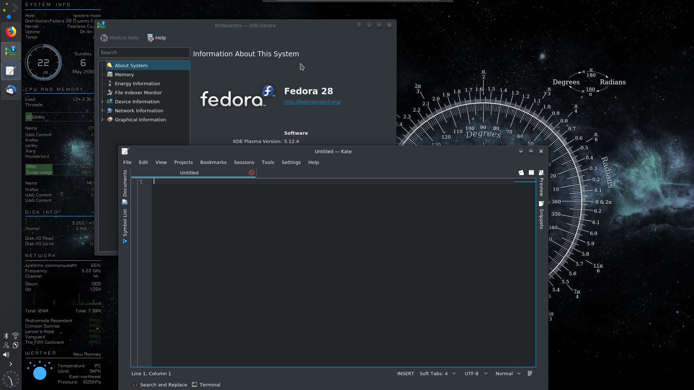

# My Plasma desktop theme

## Introduction

Files and instructions to set up the theme.

* ~/.conky contains all the scripts and files for the conky configuration
* ~/.fonts contains all fonts for the conky configuration
* ~/.local contains desktop themes and plasmoids
* ~/bin contains the startup script
* ~/Pictures/wallpaper contains the wallpaper. No really!

##  Installation

Prepare your system by installing a few packages: `sudo dnf install conky fping curl breeze-gtk plasma-oxygen` and optionally, `sudo dnf install yakuake`

Clone or download this repository to a sub-directory on your hard drive. While all the directories are on the path from your home directory, it's problably not wise to download from a random repo into your home.

Set the desktop background to ~/Pictures/wallpapers/background.png. While you're in the desktop configuration, you may as well turn off the desktop toolbox in the tweaks tab.

Move the panel to the left hand side and set the width to about 60px, it's hard to be exact with the draggable sizing.

Copy the .conky, .fonts, .local, bin and Pictures directories to your home directory.

Fire up the settings manager

Use Workspace Theme -> Look and Feel and set the theme to Breeze Dark

Use Desktop Theme -> Look and Feel and set the theme to Breeze-Aurora

Use Icons and set the theme to Oxygen

Use Application Style -> Window Decorations and set the decorations to Oxygen. Use the Wrench -> Shadows to turn off Active Window Glow

Use Application Style -> Gnome Application Style and set both Gtk2 and Gtk3 to Breeze Dark

Use Startup and Shutdown -> Autostart to add ~/bin/startup as a new script

For a consistent look, you can also set the background for the lock screen and sddm to ~/Pictures/wallpapers/background.png

Finally, and optionally right click on your menu and select Alternatives -> Simple Menu. Change it's icon to start-here-kde.svg from the Breeze icons.

Run the ~/bin/startup script

